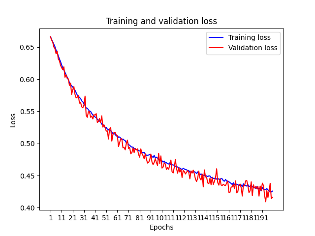

# Decoding the Presence of Tony from sEEG Recordings

## Project Overview

In this tutorial, we explore the principles of stereoencephalography (sEEG) data decoding through a practical, hands-on approach. Our objective is a binary classification task: determining the presence of Tony, a character from 'Greenbook', in a movie frame, using sEEG recordings. This project serves as an insightful introduction to the basics of sEEG decoding.

## Dataset

### Data Access and Setup

The dataset for this tutorial has been pre-processed and is ready for use. Download the dataset using your Brown University email from the links provided in our Slack channel.

#### Steps to Set Up the Data:

1. **Create a Data Folder:** In the root directory of this project, create a folder named `/data`.
2. **Download and Organize the Data:** Use the links provided in our Slack channel to download the sEEG and label data. After downloading, place these files inside the `/data` folder.

## Methods & Results

Our classification task is approached using two primary machine learning models:

1. **Fully Connected Neural Network (FCNN):** Achieving a testing accuracy of 80.34% (chance level: 61.19%), with a data split of 70% training, 15% validation, and 15% testing. Below is the training and validation loss graph. 
2. **Support Vector Machines (SVMs):** With the same dataset, this model, using a polynomial kernel and C=0.001, attained the highest accuracy of 67.24%.

## Code Organization

The repository is organized into two distinct pipelines: a PyTorch pipeline for the Fully Connected Neural Network (FCNN) and a Scipy pipeline for Support Vector Machines (SVMs).

### PyTorch Pipeline for FCNN

- `/experiments`:
  - `binary_label_classification.py`: Core training and testing logic for the FCNN model.

- `/dataset`:
  - `/binary_label_dataset.py`: Custom dataset class for the binary classification task.
- `/eval`:
  - `/eval.py`: Evaluation function used in validation and testing.
- `/models`:
  - `binary_label_fcnn.py`: Architecture definition of the FCNN model for the binary classification task.
- `/train`:
  - `train.py`: Training procedures specific to the FCNN in PyTorch.
- `/utils`: Various utility scripts.
  - `data.py`: Dataset preprocessing management.
  - `model.py`: Model operation utilities.

### Scipy Pipeline for SVMs

- `/svm`:
  - `svm_demo.ipynb`: A Jupyter Notebook demonstrating SVM implementation and usage within the Scipy framework.

